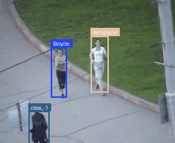

# Object Tracking with SSD & Correlation Filter

### Demo

Цветные рамки следуют за найденным объектами, вместо класса возвращается просто id объектов, поэтому классы не соответствуют объектам.

### Описание
Этот проект реализует систему отслеживания объектов (Multi-Object Tracking). Для достижения баланса между скоростью и точностью используется гибридный подход:

1.  **Детекция (SSD300):** Нейросеть (Single Shot Detector) находит объекты на кадре. Это тяжелая операция, поэтому она выполняется раз в N кадров (Keyframes).
2.  **Трекинг (Correlation Filter):** В промежутках между детекциями используется быстрый алгоритм на основе корреляции (Template Matching/Gaussian), который "ведет" объект, найденный нейросетью.

Такой подход позволяет обрабатывать видео значительно быстрее, чем покадровый запуск тяжелой нейросети.

### Структура проекта
* `detection.py` — Интерфейс работы с SSD (препроцессинг, инференс).
* `cross_correlation.py` — Реализация `CorrelationTracker`.
* `tracker.py` — Базовый класс трекера и логика связывания траекторий (IOU matching).
* `ssd_v2.py` — Архитектура нейросети SSD.
