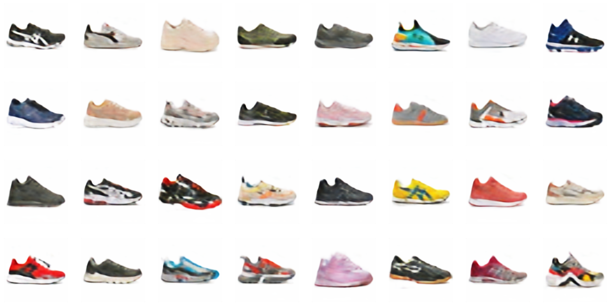

# Generative Adversarial Networks (Sneaker Generation)

### Описание проекта
Проект посвящен исследованию и реализации **Генеративно-состязательных сетей (GAN)** для задачи генерации изображений обуви (кроссовок). 

Реализация выполнена с использованием фреймворка **PyTorch Lightning**.

### Архитектура решения
Задача разбита на два этапа для улучшения качества генерации:

1.  **Generation (DCGAN):**
    * Обучение классической GAN-архитектуры.
    * **Generator:** Принимает на вход шум (Latent Vector) и преобразует его в изображение низкого разрешения.
    * **Discriminator:** Пытается отличить сгенерированные изображения от реальных фото из датасета.

2.  **Upscaling (Super-Resolution):**
    * Использование дополнительной модели для повышения разрешения сгенерированных изображений (Image-to-Image translation).

### Примеры генерации
Результат работы генератора после обучения. Модель учится воспроизводить форму, цвета и текстуры обуви из случайного шума.

### Технический стек
* **Core:** Python, PyTorch
* **Training Framework:** PyTorch Lightning
* **Visualization:** Matplotlib, Torchvision Utils
