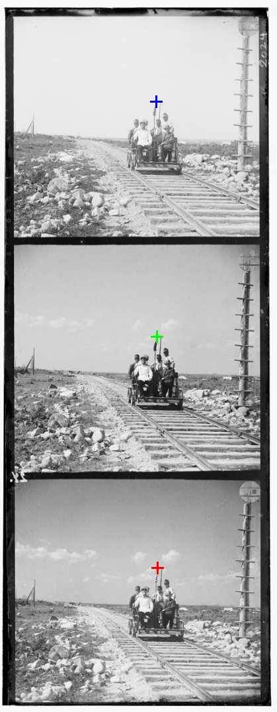
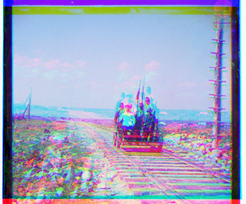

# Image Alignment & Colorization (Prokudin-Gorskii) 📷

## Описание
Этот проект реализует алгоритм автоматического совмещения (выравнивания) трех цветовых каналов для восстановления цветных исторических фотографий (на примере коллекции С.М. Прокудина-Горского).

Исходные данные представляют собой оцифрованные стеклянные негативы, где три цветовых компоненты (Blue, Green, Red) расположены вертикально. Задача алгоритма — найти оптимальные векторы смещения для каждого канала, чтобы устранить "двоение" и получить четкое цветное изображение.

## Ключевые особенности
* **Пирамида изображений (Image Pyramid):** Для обработки изображений высокого разрешения используется рекурсивный алгоритм. Смещение ищется на уменьшенной копии изображения, а затем уточняется на более высоких разрешениях. Это позволяет значительно ускорить работу алгоритма по сравнению с полным перебором.
* **Метрики:** Для оценки качества совпадения используется метрика **MSE** (Mean Squared Error) или **NCC** (Normalized Cross-Correlation).
* **Умная обрезка:** Удаление черных/белых рамок по краям изображения для улучшения качества совмещения.

## Структура проекта
* `align.py` — Основная логика алгоритма. Содержит функции:
    * `align` — базовая функция выравнивания.
    * `pyramid` — реализация пирамидального поиска (оптимизация).
* `common.py` — Вспомогательные функции (загрузка/сохранение).
* `run.py` — Скрипт запуска обработки.
* `pipeline.py` — Пайплайн тестирования.

## Примеры работы

### До и После
| Визуализация пирамиды | Результат |
| :---: | :---: |
|  |  |

## Запуск

### Требования
* Python 3.x
* NumPy
* Matplotlib / Skimage (для визуализации)

