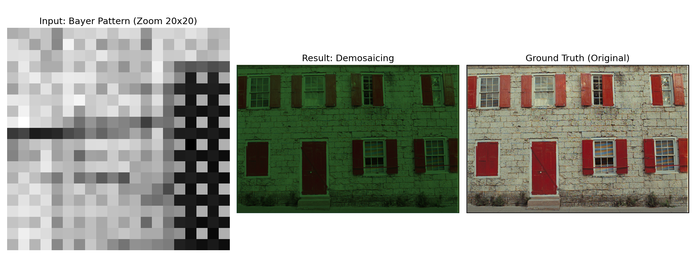

# Bayer Filter Demosaicing (RAW to RGB) 

## Описание
Проект реализует алгоритм **дебайеризации** (demosaicing) — восстановления полноцветного цифрового изображения из массива данных, полученных через фильтр Байера (Bayer filter).

Матрицы большинства цифровых камер «видят» только один цвет в каждом пикселе (красный, зеленый или синий) в шахматном порядке. Задача этого алгоритма — интерполировать недостающие цвета для каждого пикселя, используя значения соседних пикселей, чтобы получить привычное RGB-изображение.

## Ключевые возможности
* **Генерация масок Байера:** Создание булевых масок для R, G и B каналов любой размерности.
* **Билинейная интерполяция:** Восстановление пропущенных значений цвета путем усреднения соседей (с учетом краевых условий).
* **Векторизация вычислений:** Полный отказ от медленных циклов Python (`for x in width...`) в пользу матричных операций NumPy, что ускоряет обработку изображений в сотни раз.
* **Оценка качества (PSNR):** Встроенная функция расчета пикового отношения сигнала к шуму для сравнения результата с эталоном.
* **Калибровка производительности:** Скрипт `calibrate.py` для оценки вычислительной мощности машины и корректировки тайм-лимитов тестов.

## Структура проекта
* `bayer.py` — Основная логика:
    * `get_bayer_masks()` — создание паттерна масок.
    * `get_colored_img()` — алгоритм интерполяции цветов.
    * `compute_psnr()` — метрика качества восстановления.
* `calibrate.py` — Бенчмарк для измерения скорости матричных операций на текущем "железе" (для тестирующей системы).
* `common.py` — Утилиты для загрузки изображений и проверки типов данных.
* `run.py` — Скрипт запуска тестов и проверки решений.

## Визуализация

Входные данные — это одноканальная "мозаика". Алгоритм разделяет её на слои и заполняет пробелы:
1. **Green:** Самый плотный канал (50% пикселей). Интерполируется как среднее 4-х соседей (крестом).
2. **Red / Blue:** Занимают по 25%. Интерполируются по диагональным или осевым соседям.

## Требования
* Python 3.x
* NumPy
* Pillow (PIL)
