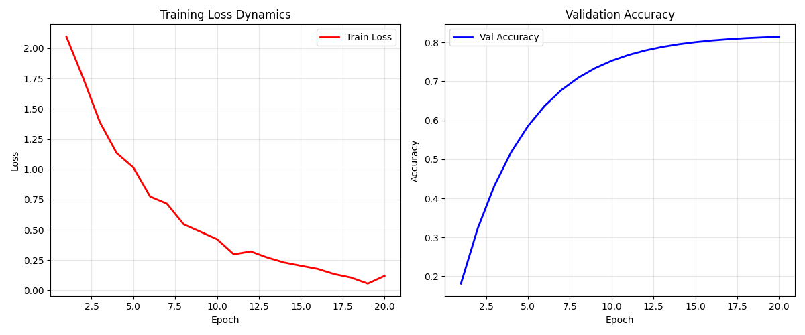

# Deep Learning Framework (NumPy Implementation)


### Описание проекта
Реализация модульного фреймворка для глубокого обучения, написанного полностью с нуля с использованием библиотеки `NumPy`. Проект демонстрирует внутреннюю механику работы сверточных нейронных сетей (CNN) без использования высокоуровневых библиотек вроде PyTorch или TensorFlow.

В рамках проекта реализованы алгоритмы прямого (Forward pass) и обратного (Backward pass / Backpropagation) распространения ошибки, а также механизмы оптимизации градиентного спуска.

На базе разработанного фреймворка построена и обучена архитектура для классификации изображений датасета **CIFAR-10**.

---

### Динамика обучения (Loss & Accuracy)
График демонстрирует сходимость модели: снижение функции потерь (Loss) и рост точности (Accuracy) на обучающей и валидационной выборках.


---

### Технический стек и возможности

Фреймворк поддерживает модульную архитектуру, аналогичную Keras `Sequential` API.

**Реализованные компоненты:**
* **Слои:** `Conv2D` (свертка), `MaxPooling`, `Dense` (полносвязный), `Flatten`, `Dropout`.
* **Активации:** `ReLU`, `Softmax`.
* **Нормализация:** `BatchNorm` (Batch Normalization).
* **Оптимизаторы:** `SGD`, `SGD Momentum`.
* **Loss-функции:** `Categorical Crossentropy`.

### 💻 Пример архитектуры

Код инициализации сверточной сети, использованной для тестов:

```python
# Инициализация модели с Momentum Optimizer
model = Model(loss=CategoricalCrossentropy(), optimizer=SGDMomentum(lr=0.01, momentum=0.9))

# Определение архитектуры
model.add(Conv2D(16, input_shape=(3, 32, 32)))  # Input: 3 канала RGB
model.add(ReLU())
model.add(Pooling2D())

model.add(Conv2D(32))
model.add(ReLU())
model.add(Pooling2D())

model.add(Conv2D(64))
model.add(ReLU())
model.add(BatchNorm())
model.add(Dropout(0.4))

model.add(Flatten())
model.add(Dense(128))
model.add(ReLU())
model.add(Dropout(0.4))
model.add(Dense(10))  # Output: 10 классов
