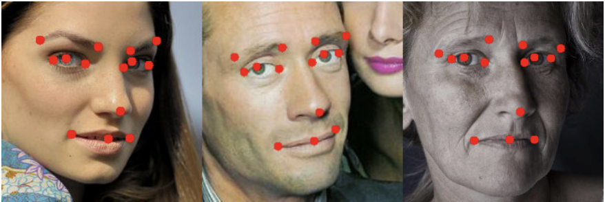

# Facial Keypoints Regression (PyTorch)

### Описание проекта
Проект решает задачу **регрессии ключевых точек лица** (Facial Keypoints Regression). Задача модели: по изображению лица человека предсказать координаты 14 антропометрических точек (уголки глаз, брови, нос, контуры губ).

### Архитектура Нейросети
В проекте реализована кастомная сверточная сеть (CNN) на базе `torch.nn.Module`.
Особенности архитектуры:

* **Backbone:** 3 сверточных блока. В каждом блоке используется `Conv2d` (увеличение каналов 16 → 38 → 196), `BatchNorm2d` для стабилизации обучения и `ReLU`. Снижение размерности (downsampling) происходит за счет `stride=2`.
* **Adaptive Pooling:** Использование `AdaptiveAvgPool2d((4,4))` перед полносвязными слоями позволяет сети обрабатывать входные изображения с небольшими отклонениями в размере и фиксирует размер тензора перед классификатором.
* **Regression Head:** Полносвязный блок (`Linear`) с `Dropout(0.4)` для предотвращения переобучения. Выходной слой содержит 28 нейронов (координаты X, Y для 14 точек).

### Результаты
Модель успешно определяет геометрию лица на тестовых изображениях с ошибкой MSE <= 5

*Проект выполнен с использованием PyTorch и Albumentations для аугментации данных.*
